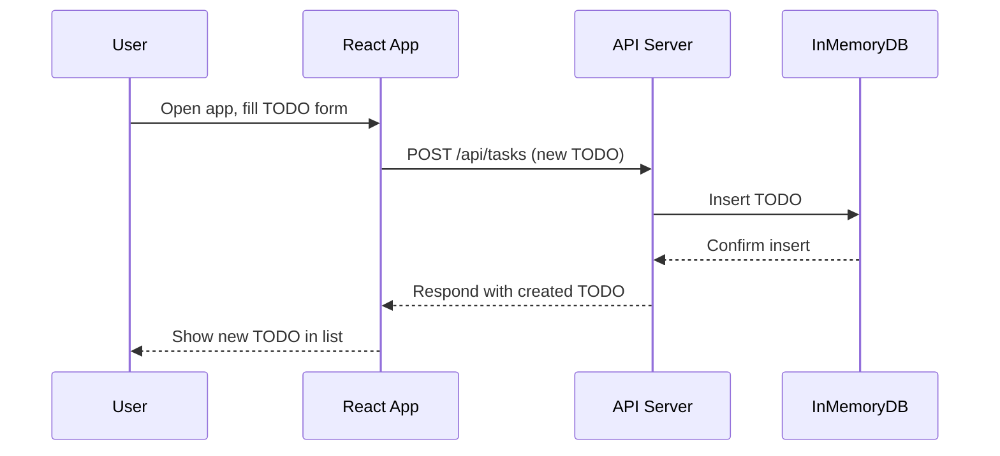

# Cloud Architecture Overview

```mermaid
## Cloud Architecture Overview

```mermaid
architecture-beta
    group frontend(cloud)[Frontend]
    group backend(cloud)[Backend]

    service user(internet)[User]
    service reactapp(server)[React App] in frontend
    service apiserver(server)[API Server] in backend
    service inmemorydb(database)[InMemoryDB] in backend

    user:R -- L:reactapp
    reactapp:R -- L:apiserver
    apiserver:B -- T:inmemorydb
```

## Sequence: User Creates a TODO



